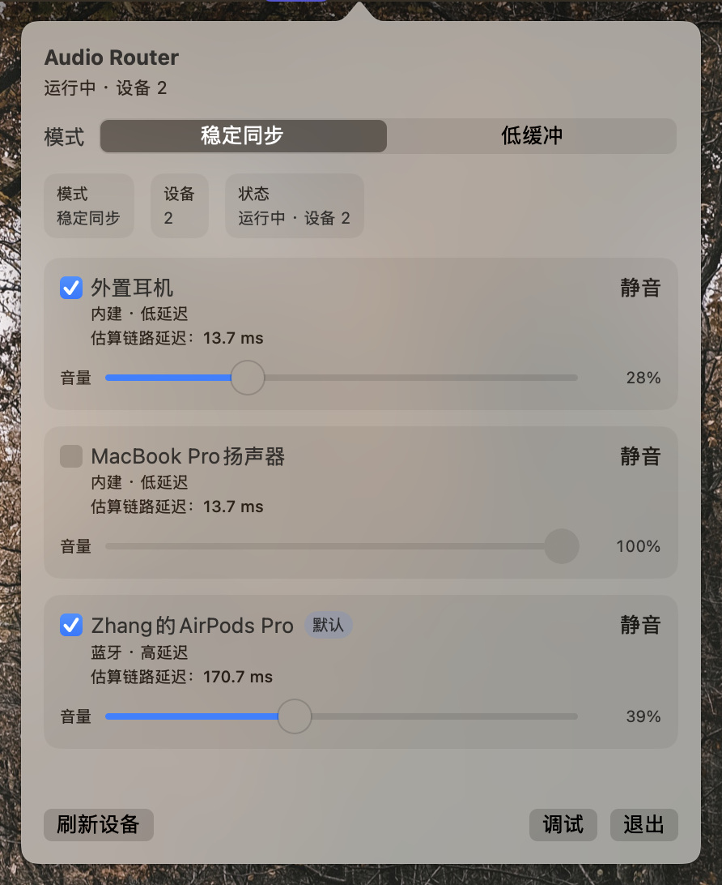

# Audio Router



一个面向 macOS 的多设备音频输出菜单栏应用。

`Audio Router` 的目标是让系统正在播放的音频同时输出到多个物理设备，并支持每个设备单独调节音量，重点场景包括：

- 蓝牙耳机 + 有线耳机同时听
- 多个蓝牙耳机同时听
- 内建设备 + 外接设备同步输出

## 功能

- 同时选择多个输出设备
- 每个设备独立软件音量
- 每个设备独立静音
- 设备热插拔自动刷新
- 设备状态持久化
- 菜单栏常驻使用

## 当前实现

当前版本基于 Core Audio 的正式主链：

- `Process Tap` 捕获系统正在播放的音频
- 私有 aggregate device 驱动捕获回调
- 共享 PCM 环形缓冲保存实时音频帧
- 每个物理设备独立输出会话
- 每个设备独立软件增益

## 系统要求

- macOS 14.2 或更高版本

## 快速开始

### 1. 构建和测试

```bash
cd audio_router
swift build
swift test
```

### 2. 打包 DMG

系统音频捕获请优先使用 `.app` 启动，不要直接用裸可执行文件。

```bash
cd audio_router
zsh scripts/package_app.sh
```

打包产物在：

- `.build/dist/Audio Router.app`
- `.build/dist/AudioRouter-0.1.1-macos.dmg`

本地调试启动：

```bash
open ".build/dist/Audio Router.app"
```

### 3. 授权

第一次启动并开始捕获系统音频时，请允许：

- 系统音频录制

如果没有弹权限，可以去系统设置里检查对应授权状态。

## 安装

从 GitHub Release 下载最新的 `AudioRouter-*-macos.dmg`，打开后将 `Audio Router.app` 拖到 `Applications`。

当前公开包默认未使用 Developer ID 签名和 Apple 公证。首次打开如果被系统拦截，可以在 Finder 中右键应用并选择打开。若需要免安全提示的正式分发，需要配置 Apple Developer ID 签名和公证。

## GitHub 发行

仓库已配置 tag 触发的 GitHub Release 流水线。发布新版本时：

1. 更新 `Resources/Info.plist` 中的 `CFBundleShortVersionString`。
2. 更新 `CHANGELOG.md`。
3. 本地验证：

```bash
swift test
zsh scripts/package_app.sh
```

4. 提交并推送主分支。
5. 创建并推送版本 tag：

```bash
git tag v0.1.1
git push origin main
git push origin v0.1.1
```

推送 tag 后，GitHub Actions 会在 `macos-26` runner 上运行测试、生成 DMG，并创建对应 GitHub Release。这里固定 `macos-26` 是为了匹配项目使用的 Swift tools 6.2，避免 `macos-latest` 后续迁移导致工具链变化。

## 测试

```bash
cd audio_router
swift test
```

## 项目结构

```text
audio_router/
├── Sources/AudioRouterApp
├── Tests/AudioRouterAppTests
├── Resources
├── scripts
├── docs
├── Package.swift
└── README.md
```

## 已知限制

- 当前仍是第一版底层实现
- 蓝牙与有线混合场景还没有做更精细的自动延迟补偿
- 更复杂的设备时钟漂移补偿仍待完善
- 某些非标准 PCM 输出设备还需要继续兼容

## 路线图

- 更完善的延迟补偿
- 更稳的断连恢复
- 更好的设备状态展示
- 更广的输出格式兼容

## 文档

- [产品方案](docs/产品方案.md)
- [技术方案](docs/技术方案.md)

## 贡献

欢迎提交 Issue 和 Pull Request。

开始贡献前请先阅读：

- [CONTRIBUTING.md](CONTRIBUTING.md)

## License

[MIT](LICENSE)
